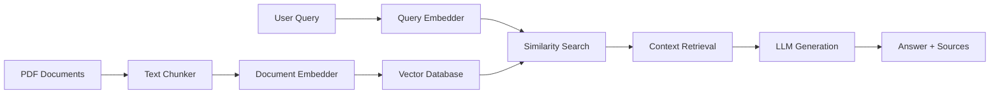

# AgriGen - Crop Advisory Assistant

## Intelligent Agricultural Knowledge System with RAG Architecture

### **Overview**

AgriGen is an intelligent agricultural advisory system that combines Retrieval-Augmented Generation (RAG) with multi-modal AI capabilities to provide farmers with expert agricultural guidance. The system processes agricultural documents, analyzes crop images, and responds to voice queries using state-of-the-art AI models.

---

## **System Architecture**

```mermaid

```

---

## **Data Flow Architecture**

```mermaid
sequenceDiagram
    participant U as User
    participant F as Frontend
    participant B as Backend
    participant R as RAG Pipeline
    participant V as Vector DB
    participant A as AI Models
  
    U->>F: Ask Question
    F->>B: Process Query
    B->>R: Retrieve Context
    R->>V: Search Embeddings
    V-->>R: Return Relevant Docs
    R->>A: Generate Answer
    A-->>R: AI Response
    R-->>B: Answer + Sources
    B->>F: Display Results
    F-->>U: Show Answer
```

## **Core FeaturesMulti-Model AI Integration**

>>>>>>> hybrid_rag
>>>>>>>
>>>>>>
>>>>>
>>>>
>>>
>>

- **Text Models**: Llama 3.3 70B, GPT OSS 120B, Mixtral 8x7B
- **Vision Models**: Llama 4 Maverick for crop image analysis
- **Speech Models**: Whisper Large v3 for voice input
- **Parallel Processing**: Query multiple models simultaneously

### **RAG (Retrieval-Augmented Generation)**

- **Document Processing**: PDF ingestion and chunking
- **Vector Embeddings**: GTE-Large model for semantic search
- **FAISS Database**: Efficient similarity search
- **Source Diversity**: Intelligent source selection algorithm

### **Chat Management**

- **Session Persistence**: SQLite-backed chat history
- **Chat Operations**: Rename, delete, and manage conversations
- **Model Tracking**: Track which models provided answers
- **Source Attribution**: Link answers to specific documents

### **Multi-Modal Input**

- **Text Queries**: Traditional text-based questions
- **Voice Input**: Speech-to-text with Groq Whisper
- **Image Analysis**: Upload crop images for AI analysis
- **Combined Queries**: Mix text, voice, and image inputs

---

## **Technical Implementation**

### **RAG Pipeline Architecture**



### **Vector Database Schema**

| Field           | Type   | Description             |
| --------------- | ------ | ----------------------- |
| `chunk_id`    | String | Unique chunk identifier |
| `document_id` | String | Source document ID      |
| `text`        | String | Chunk content           |
| `source`      | String | File path               |
| `embedding`   | Vector | 1024-dim embedding      |
| `metadata`    | JSON   | Additional chunk info   |

### **Chat Memory Schema**

| Field          | Type     | Description      |
| -------------- | -------- | ---------------- |
| `id`         | Integer  | Primary key      |
| `session_id` | Integer  | Chat session     |
| `query`      | String   | User question    |
| `model`      | String   | AI model used    |
| `answer`     | Text     | AI response      |
| `sources`    | JSON     | Source documents |
| `timestamp`  | DateTime | Creation time    |

---

## **Installation & Setup**

### **Prerequisites**

- Python 3.11+
- Groq API Key
- 8GB+ RAM (for embeddings)

### **Installation**

```bash
# Clone repository
git clone https://github.com/your-repo/crop-advisory-assistant
cd crop-advisory-assistant

# Create virtual environment
python -m venv env
source env/bin/activate  # On Windows: env\Scripts\activate

# Install dependencies
pip install -r requirements.txt

# Set up environment
cp .env.example .env
# Edit .env with your Groq API key
```

### **Environment Configuration**

```env
# .env file
API_KEY=your_groq_api_key_here
FAISS_STORE_PATH=faiss_store
DATA_DIR=data/raw
```

### **Running the Application**

```bash
# Start FastAPI backend
cd backend
python main.py

# Start Streamlit frontend (in new terminal)
cd frontend
streamlit run app.py
```

---

## **Performance Metrics**

### **System Performance**

- **Document Processing**: ~2-3 seconds per PDF
- **Query Response**: ~3-5 seconds average
- **Vector Search**: <100ms for similarity search
- **Memory Usage**: ~2GB for 1000+ document chunks

### **Model Performance**

- **Llama 3.3 70B**: High accuracy, ~3s response time
- **GPT OSS 120B**: Excellent reasoning, ~4s response time
- **Vision Models**: ~2s for image analysis
- **Whisper**: ~1s for 10-second audio transcription

---

## **Testing & Development**

### **RAG Pipeline Testing**

```bash
# Run notebook tests
cd notebooks
jupyter notebook rag_test.ipynb
```

### **API Testing**

```bash
# Test backend endpoints
curl -X POST "http://localhost:8000/api/chat" \
  -H "Content-Type: application/json" \
  -d '{"query": "How to manage pests in wheat?"}'
```

### **Frontend Testing**

```bash
# Run Streamlit app
streamlit run frontend/app.py
```

---

### **Docker Deployment**

```dockerfile
# Dockerfile example
FROM python:3.11-slim
WORKDIR /app
COPY requirements.txt .
RUN pip install -r requirements.txt
COPY . .
CMD ["streamlit", "run", "frontend/app.py"]
```

---

## **Future Enhancements**

### **Planned Features**

- [ ] **Multi-language Support**: Hindi, Spanish, French
- [ ] **Advanced Analytics**: Usage patterns, model performance
- [ ] **Mobile App**: React Native mobile interface
- [ ] **Offline Mode**: Local model deployment
- [ ] **API Rate Limiting**: User-based rate limiting
- [ ] **Response Caching**: Redis-based answer caching

### **Technical Improvements**

- [ ] **Microservices**: Split into independent services
- [ ] **Message Queues**: Redis/RabbitMQ for async processing
- [ ] **Monitoring**: Prometheus + Grafana dashboards
- [ ] **CI/CD**: GitHub Actions for automated testing
- [ ] **Documentation**: API documentation with Swagger

---

## **Contributing**

### **Development Setup**

1. Fork the repository
2. Create feature branch: `git checkout -b feature/amazing-feature`
3. Commit changes: `git commit -m 'Add amazing feature'`
4. Push to branch: `git push origin feature/amazing-feature`
5. Open Pull Request

## **License**

This project is licensed under the MIT License - see the [LICENSE](LICENSE) file for details.
